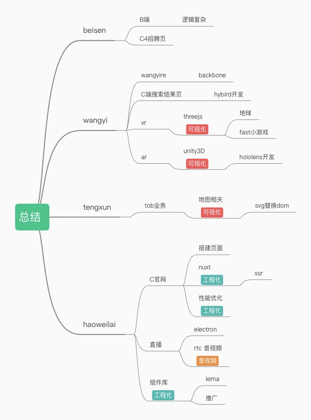
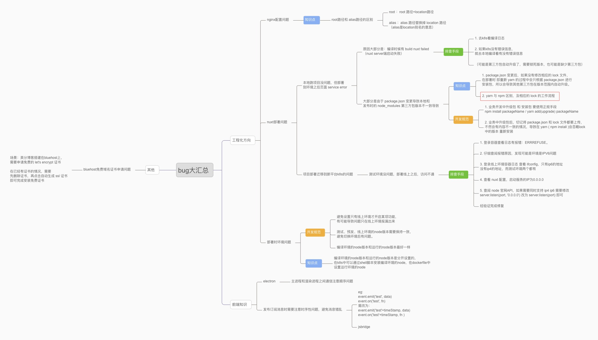

#### 0217
### setTimeout/setInterval、requestAnimationFrame 三者的区别：
1. 引擎层面
   setTimeout/setInterval 属于 JS引擎，requestAnimationFrame 属于 GUI引擎
   JS引擎与GUI引擎是互斥的，也就是说 GUI 引擎在渲染时会阻塞 JS 引擎的计算
2. 时间是否准确
   requestAnimationFrame 刷新频率是固定且准确的，但 setTimeout/setInterval 是宏任务，根据事件轮询机制，其他任务会阻塞或延迟js任务的执行，会出现定时器不准的情况
3. 性能层面
   当页面被隐藏或最小化时，setTimeout/setInterval 定时器仍会在后台执行动画任务，而使用 requestAnimationFrame 当页面处于未激活的状态下，屏幕刷新任务会被系统暂停

### 0523

#### Lerna 

`npm install`：安装devDependencies和dependencies的依赖

`npm install --production` : 只安装dependencies的依赖

​		tips: (使用场景很少，如果在CI上配置这个命令，其实很容易导致项目构建失败，因为一旦判断错误，将应该放到dependencies的包放到devDependencies，就会导致构建失败)

`npm install A`：A组件依赖的devDependencies不会被下载，只会下载A组件的dependencies

### 0711

ssr

### 0802

1. tailwindcss

2. `ssr` vs `ssg`

​	

#### 8.5

https://www.processon.com/mindmap/64cdb0d3c1af4746895b4265

Vue2和Vue3的自定义指令钩子方法对照关系如下：

| Vue2 钩子方法 5个 |      |                |
| ----------------- | ---- | -------------- |
| bind              |      | //被绑定       |
| inserted          |      | //绑定到节点   |
| update            |      | //组件更新     |
| componentUpdated  |      | //组件更新完成 |
| unbind            |      | //解绑         |

| Vue3 钩子方法 7个      |                                            |
| ---------------------- | ------------------------------------------ |
| created                | 元素创建后，但是属性和事件还没有生效时调用 |
| beforeMount （new）    | 仅调用一次，当指令第一次绑定元素的时候     |
| mounted                | 元素被插入父元素时调用.                    |
| beforeUpdate           | 在元素自己更新之前调用                     |
| updated                | 元素或者子元素更新之后调用.                |
| beforeUnmount  （new） | 元素卸载前调用                             |
| unmounted              | 当指令卸载后调用，仅调用一次               |

#### 9.14

#### 文件上传（multipart/form-data  VS  base64）

直接传输二进制流 和 传输通过base64编码后的字符串的对比。

1. 为什么不直接传输字符串，而是用base64编码？

   一些系统对特殊字符存在限制、会被当作特殊含义处理。所以直接转普通字符串可能失真，故需要将上传文件转成base64编码字符再转成字符串，不可以将二进制流直接转成字符串。

   

> 总结
>
> 1. multipart/form-data 可传输二进制流，效率较高
> 2. Base64 不受请求方式的限制，可直接用 application/json 请求方式，更灵活。

* 使用Base64编码上传文件的好处：
  通用性：Base64编码的结果是`ASCII字符串`，这是一种通用的字符集，可以在几乎所有系统中被解析。
  兼容性：HTTP协议是文本协议，一些非ASCII字符在传输过程中可能出现问题。Base64编码将二进制数据转换成纯文本，避免了这个问题。
  数据封装：有时候，我们可能需要将文件和其他数据（如文本、JSON等）一起发送。Base64编码可以让我们把文件编码成字符串，并和其他数据一起发送。

* 弊端：体积增大：Base64编码会使数据体积增大约33%，因为每3个字节的数据需要用4个字节的Base64字符来表示。
  CPU使用率：编码和解码Base64需要CPU资源，大量的Base64编码/解码可能会影响性能。

#### setTimeout / setInterval / requestAnimation

1. 当页面失焦或者最小化时，`setTimeout` 和 `setInterval` 变的不准确。 大多数现代浏览器在标签页处于非活动状态时会减慢 JavaScript 的执行速度以节省资源。这意味着 `setTimeout` 和 `setInterval` 可能不会按预期那样准确地执行。例如，Firefox 和 Chrome 就将非活动标签页中的最短超时值限制在1000毫秒左右。在某些情况下（如电池供电模式），某些浏览器甚至可能完全暂停非活动标签页中的 JavaScript 执行。

2. 当标签页被切换到后台或者最小化时， `requestAnimationFrame` 会暂停，大多数浏览器为了节省CPU和电池资源会暂停。

3. **setTimeout产生的任务会直接push到任务队列中；**

   **setInterval在每次把任务push到任务队列前，都要进行一下判断。**

   **(看上次的任务是否仍在队列中，如果存在就不会插入，所以不是每个轮训方法都会被执行)**。

4. 如果需要持续运行某些代码（无论页面是否在焦点），可能需要寻找其他解决方案如Web Workers等。

23.10 至今  北京好未来教育科技有限公司

海外官网业务

负责好未来海外业务的官网业务线，主要包括课程购买的全流程、多账户信息维护、支持国际化等等。官网项目包含web、touch、客户端内置apph5 3个独立项目，经手之后逐步将3端合1，提高了项目的可维护性，并降低了代码重复率。官网项目使用 vue 技术栈。

vitas 组件库

使用 lerna 搭建组件库，并搭建部署组件库文档。目前已经研发了4个功能组件，包括拖拽指令组件、加密电话号码、谷歌防刷组件、倒计时组件。以及若干UI组件。其中拖拽组件已落地4个项目、防刷组件已落地5个项目。

edu项目

edu项目面向海外用户投放在海外教育学习平台上，主要用于获取新用户，针对不同知识点的小测试来让学生自测对知识点的掌握情况，并且包含对知识点的详细解析等等功能。独立负责从0到1搭建edu项目，使用 nuxt 框架搭建，友好支持 ssr。
