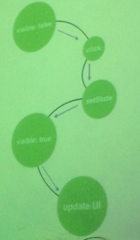
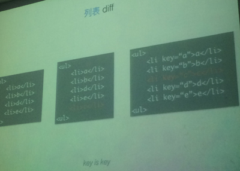
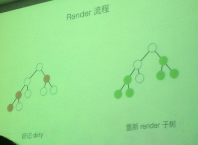
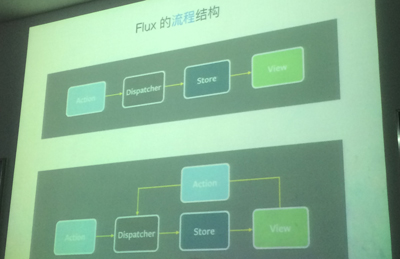
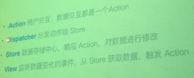

## React技术专场 8.29 
##### notes by Melody

---------------


### 提纲
* Thinking in React 陈益国 玉伯
* reactjs and inline styles 墨刀
* react flux组件定制化实践 王玥
* react native  美团客户端内部实践总结


###  Thinking in React

* 拥抱未来
    1. webcomponents : 封装性（shadow DOM） 可移植性（原生支持）
    2. react : 高性能（virtual DOM） 松耦合
    可结合使用 react + web Component

    #####  React 特性: 
        同构(一次编写 多次运行)
            Client + Server Rendering
            更好的用户体验（react放到服务器 减少白屏）
            可维护性
            SEO
        兼容ES6 ES7 (ES6 all)
    
* 设计原则
    ##### 对比：
        render HTML tag
        render a component
            React.createClass({..});

    ##### 状态机：
        抛弃繁琐DOM ，只维护数据
            eg: 下拉菜单的两种状态
                state:收起  state:展开

        react组件生命周期:
            初始化 -> 渲染（render） -> 装载（组件初始化） -> 更新 -> 卸载
    ##### 设计原则 总结：
        化繁为简 可预测性 单向数据流
        不需和DOM打交道，只和虚拟DOM
        数据单向：父组件 -> 子组件
* 高性能
    ##### javascript 慢，原因归结于操作DOM 引起页面的回流及重绘 
    ##### virtual DOM 可视为js对象 
        创建虚拟dom两种方式: 1.react  2.native
        4个简单的属性，没有prototype 
            ReactElement{
                type:
                ref:
                key:
                props: object
            }
            React.render 方法将 ReactElement 渲染成真实的DOM

    ##### react 内部 diff 算法，用来把虚拟to真实DOM
        原理：
            同层级只替换属性？

            列表diff，添加一个li，指定一个唯一的key当属性？
                   
        react render过程
            1. setState是异步操作
````
            this.state = {
                foo: null
            }
            this.setState({
                foo: 'bar'
            })
            console.log(this.state.foo); //null
````
            
            不会立即响应，等component生命周期完了之后，再遍历UI 
            2. render 流程

                render 会自动render 子节点
                思考:如果是最上层的，会不会影响性能？这时候用diff算法，重绘
                方法shouldComponentUpdate用于性能优化
                    false 不会渲染
                    true 默认 会渲染
            3. react 事件代理 更优
                * 一个组件只有一个根节点
                * 绑定至文档的根节点 
                * 仅迭代组件的根节点（存储事件id到根节点，不用一层一层冒泡）
                
* 生态圈

    ##### 组件通信

        双向绑定 pk 单向数据流
        * angularjs 双向绑定 
            脏检查、Object.observe(ES7新属性) 
            problem: UI更新还是数据更新 分不清
                    复杂度高，数据不可预测
        * react 单向
            setState & immutable
            简单清晰，数据可预测
            
    ##### Flux
    
        1. 流程结构，数据的流转，view就是一个component

        解决的问题： 数据流转、存储
        2. 四个部分详解

        problem:
            * 不能同时触发两个action 解决方案：监听事件
            * 太多action store 监听 冗余 解决方案：重写flux
        3. Relay + GraphQL
            Relay解决的问题：频繁取数据的时候，relay封装取数据的操作，合并成一个请求，变成一个查询语句
            GraphQL和relay结合用 相当于serve端，做数据存取都是跨平台、终端
            
    ##### React
        可适用 Web IOS Android Canvas
        


