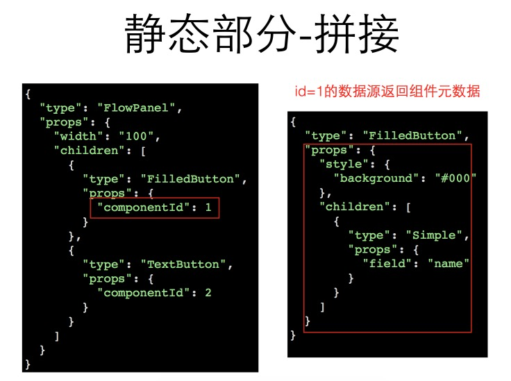
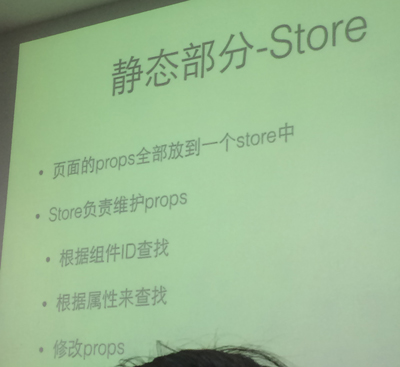

# react flux组件定制化实践

------------------

### 可配置的UI组件

#### 静态部分：
    把组件props 用统一数据结构结合
#### 交互部分：
    把导致props改变function组合起来
  
* 基础组建和布局组件的组合（可嵌套业务组件）
* ……

#### 静态部分：
    1.数据
        通过静态数据描述组件
 

    2.拼接
 

    3.数据流和context
        业务组件和非业务组件的数据处理
 

    4.静态部分 store
 

#### 交互部分：
 

    1.规则
 

    2.action
 

    eg:
 

    3.ActionHandler
 

#### 一些Flux框架
    Reflux
    Redux

