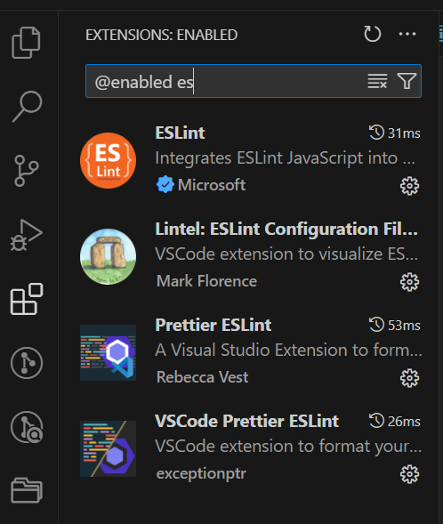

### eslint 配置

1. npm i -D eslint
2. npx eslint --init
3. 完善 .eslintrc.js
4. 下载 eslint eslint-prettier 如图（不要安装冗余插件）

5. vscode settings.json

```js
{
    "workbench.iconTheme": "vscode-icons",
    "eslint.nodeEnv": "",
    
    "editor.codeActionsOnSave": {
        
    
    
        "source.fixAll": "explicit"
    },
    "eslint.codeAction.showDocumentation": {

        "enable": true
    },
    "editor.tabSize": 2,
    "workbench.tree.indent": 20,
    "explorer.confirmDelete": false,
    "git.path": "C:/Program Files/Git/bin/git.exe",
    "vsicons.dontShowNewVersionMessage": true,
    "editor.suggestSelection": "first",
    "vsintellicode.modify.editor.suggestSelection": "automaticallyOverrodeDefaultValue",
    "terminal.integrated.tabs.location": "left",
    "[html]": {
        "editor.defaultFormatter": "vscode.html-language-features"
    },
    "workbench.startupEditor": "none",
    "editor.fontWeight": null,
    "terminal.integrated.profiles.windows": {
        

        "PowerShell": {
            "source": "PowerShell",
            "icon": "terminal-powershell"
        },
        "Command Prompt": {
            "path": [
                "${env:windir}\\Sysnative\\cmd.exe",
                "C:\\Windows\\System32\\cmd.exe"
            ],
            "args": [],
            "icon": "terminal-cmd"
        },
        "Git Bash": {
            "source": "Git Bash"
        }
    },
    "vetur.ignoreProjectWarning": true,
    "diffEditor.ignoreTrimWhitespace": false,
    "git.autofetch": true,
    "extensions.ignoreRecommendations": true,
    "gitlens.views.searchAndCompare.avatars": false,
    "workbench.editor.empty.hint": "hidden",
    "[scss]": {
        "editor.defaultFormatter": "rvest.vs-code-prettier-eslint"
    },
    "[vue]": {
        "editor.defaultFormatter": "rvest.vs-code-prettier-eslint"
    },
    "[javascript]": {
        "editor.defaultFormatter": "rvest.vs-code-prettier-eslint"
    },
    "editor.fontSize": 16,
    "workbench.colorTheme": "One Dark Pro"
}
```