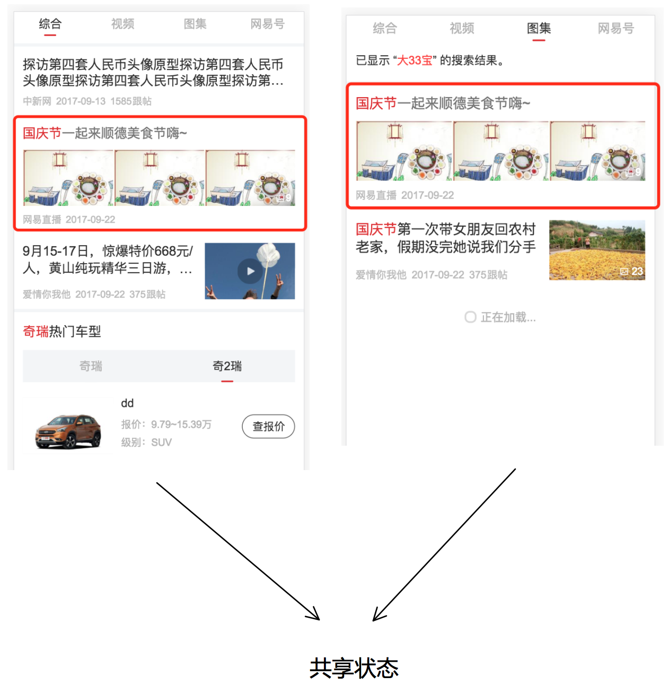
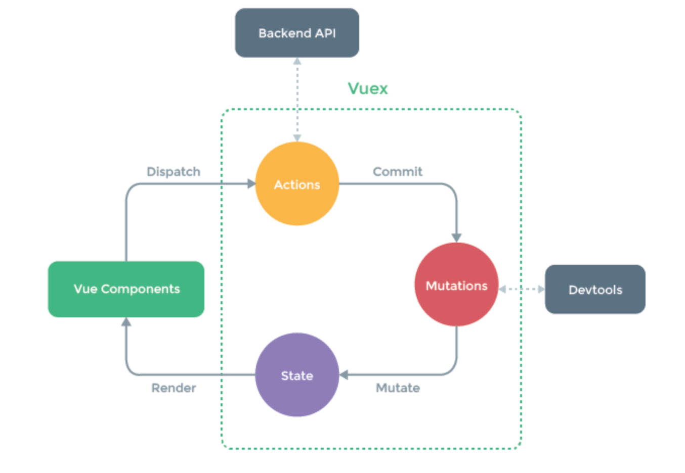

# 【搜索项目】code review v2

---

### 提纲
1. 上次提出的优化点
2. standard
3. vuex

### 一、上次提出的优化点
1. doc 封装成组件
2. 使用 v-bind:is 替换掉之前的 if else

##### 优化结果：
* 代码行：115 -> 7
* 之后新增模块不需要再修改 template了

### 二、standard

##### 优点：
1. 没有配置文件
2. 自动规范代码
3. 更早的发现问题

##### 缺点：
1. 不能修改规则

### 三、vuex（数据托管中心）
* 业务背景：阅读状态同步
* 如图：

* 实施：
    - 把所有已读的文章ID都存放到 readedDocIds 数组里
    - 在 template 渲染时判断当前文章是否是已读状态
    - 点击文章后发送 dispatch 到 action 再到 mutation 操作新增已读文章ID

**“不是项目中所有的数据传递都必须用vuex”**

## 后期规划
#### 优化：
* 针对 mutation action 写一些测试用例
* 修改上线发布流程
* 着手做项目异常监控

#### 业务

