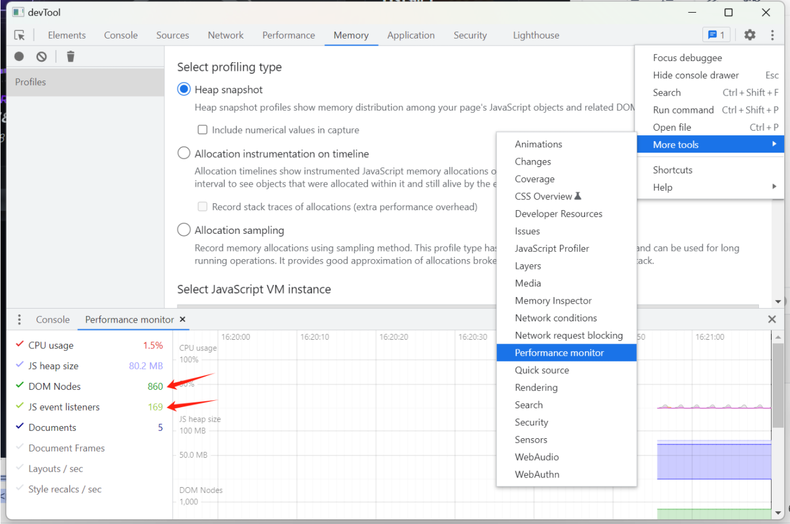
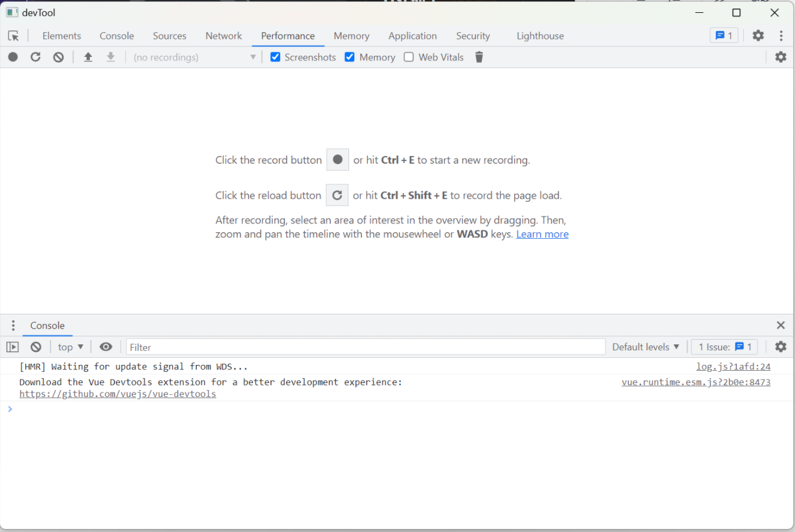

### 工具：




### 前端代码自查：

##### 1. 定位问题：到哪个页面或者哪个操作后 dom 以及 事件 没有释放

##### 2. 代码自查

1. setTimeout 定时器有没有清理
2. setInterval 清理
3. requestAnimation 清理
4. window.addEventListener('click') 添加的事件有没有被 remove 掉
5. 是否存在循环引用
6. video 标签，当切换video标签src时，上一个video资源不会被清理，需要手动置为null

```
this.$refs.videoDom.pause() 
this.$refs.videoDom.currentTime = 0 
this.$refs.videoDom.src = null
```

 8. input 标签本身不会被回收，这个是chrome的已知问题
 9. keepalive 会缓存内容，尽量不要缓存所有，指定 include 的值
 10. keepalive 标签慎用，内部尽量不要放 routerView， 必须放 routerView 时一定小心指定 include值
 11.  当使用 keepalive 时需要注意 unactivated、beforeDestroy 都需要清理事件、定时器等；在添加事件之前 清理掉上一个的事件。
 12. RouterView 标签内部组件，尽量不要放 router-link

```html
// 标准写法 
<section>
	<router-link to='/a'></router-link>    
	<router-link to='/b'></router-link> 
</section> 
<RouterView />
```

13. 第三方库 svgaplayerweb 在切换时销毁dom也没有清干净。原因：只清空了SVGA绘制的canvas画布，没有停止绘制的动画循环。

```js
// 轮播切换 svga 时，都需要清理：

player.clear() // 清画布
player.stopAnimation(true) // + 停止动画循环

```


